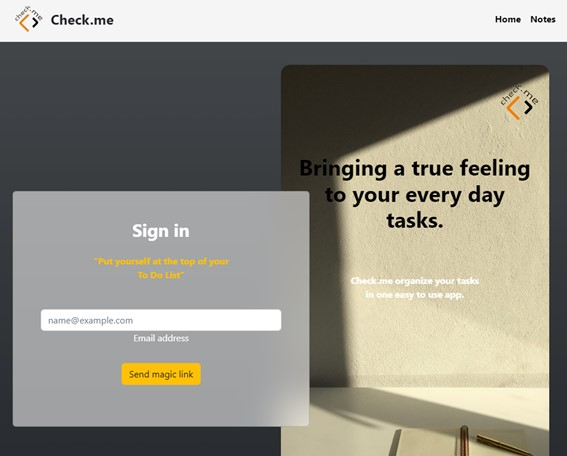
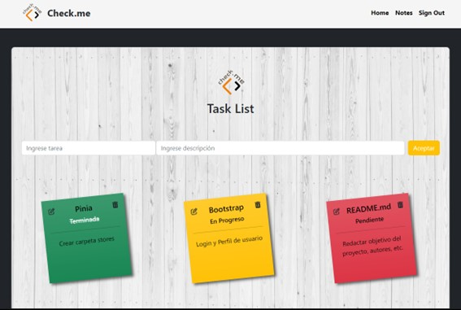

 

      
    <h1 align="center"> Check.me </h1>
    

        <a href="https://check-mi.netlify.app/"> View Check.me deployed in Netlify </a>
    

 

## Ironhack Final Project

Ironhack Frontend final project. The objective was to build a To-Do List using technologies such as: Vue, Supabase and Pinia. 

 

 

 

## 🚀 About Check.me
Check.me is a To-Do List application aim to manage your daily tasks in an easy and useful way. 
You can organize your tasks just checking its colour state: pending-red, in progress-orange and done-green.

  

### 👷 Authors

|                     | Name                | GitHub              |
| :------------------ | :------------------ | :------------------ |
|  | **Albert Santamaria** | [**@albertsanle**](https://github.com/albertsanle) |
|  | **Yeny Adama** | [**@YenyAdama**](https://github.com/YenyAdama)  |
|  | **Javier Esparza** | [**@JReuman1**](https://github.com/JReuman1) | 
|  | **Txell Amigó** | [**@txellext**](https://github.com/txellext) |   

 

### 🦋 Goals

- Use Vue.js to create an app
- Connect a Vue.js app to Supabase (Database as a Service)

 

### ❗ Deliverables

The functionality should include:

- Authentication (sign up, sign in, sign out)
- A front-end that displays the user’s personal to-do list
- An ability to add new tasks
- An ability to edit existing tasks
- An ability to mark tasks as complete/incomplete
- An ability to delete existing tasks
- A store and a database that your app can call data from

 

### 🛠️ Technical specifications

Technical Stack:
- Client: Vue.js, Vite (dev server)
- Router: Vue Router
- Store: Pinia and Pinia Persist for persistent login
- Database as a service: Supabase

 

### 🌐 Built with
- Vue 

- 
- 
- 
- 
- 
- 

<h2 align="center">🤝 Support</h2>

🎊 Contributions, 🔥 issues, 🐛 bugs, and 🥮 feature requests are most welcome!

💙 If you like this project, Give it a ⭐ and Share it with friends!

Made with ❤️ in BCN/CCS
